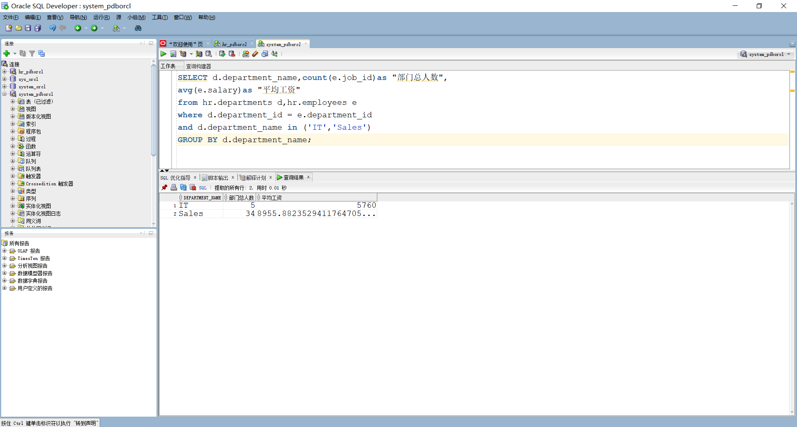
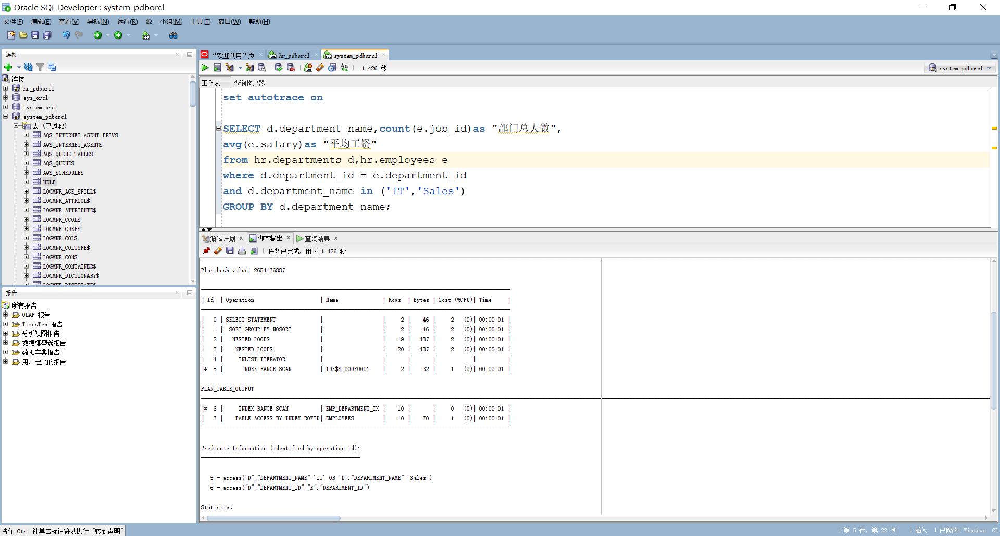
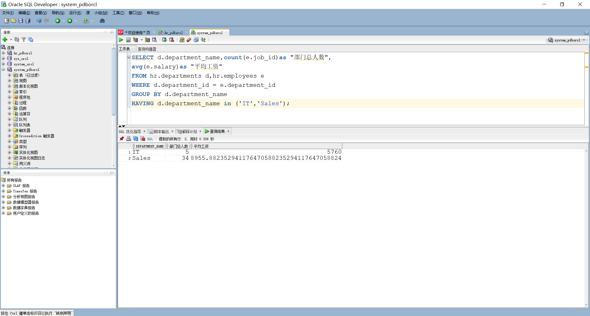
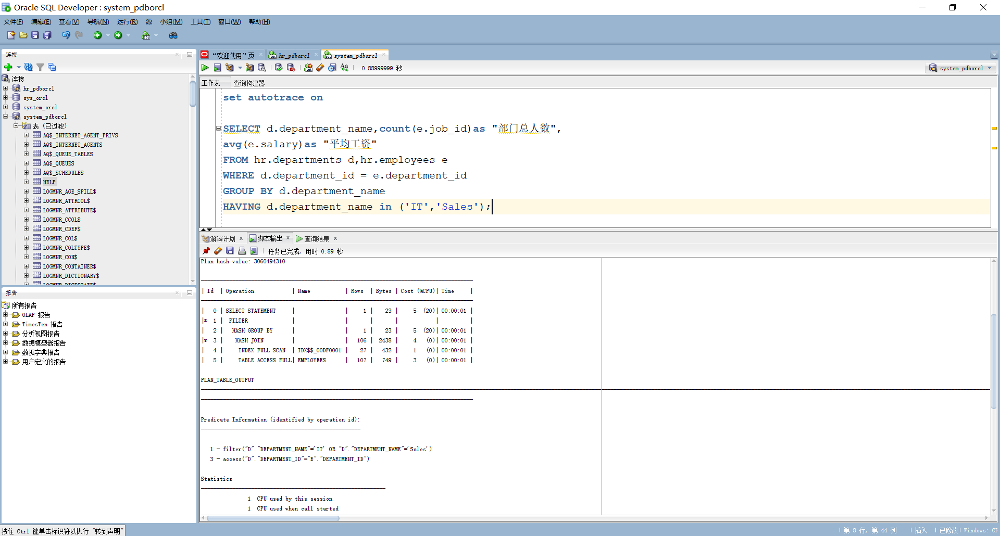
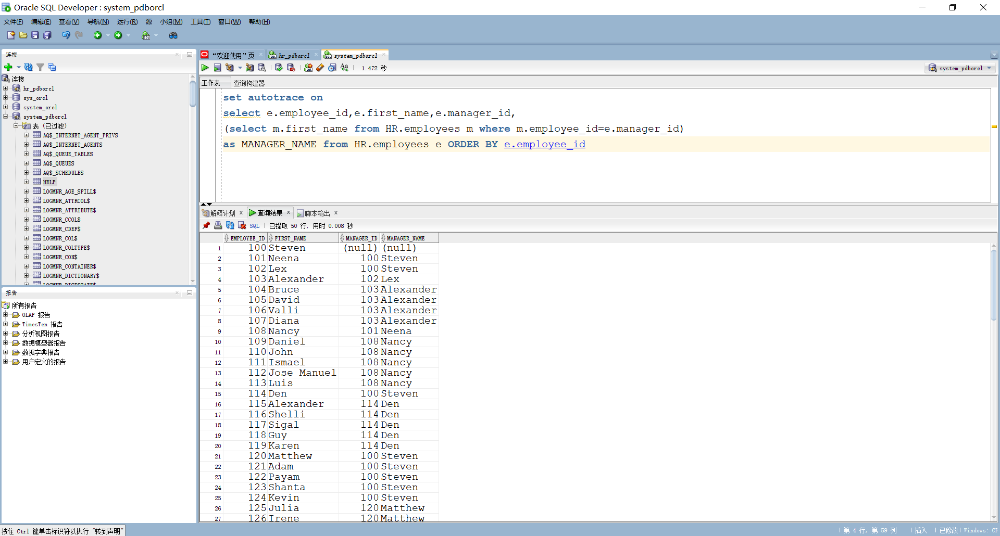
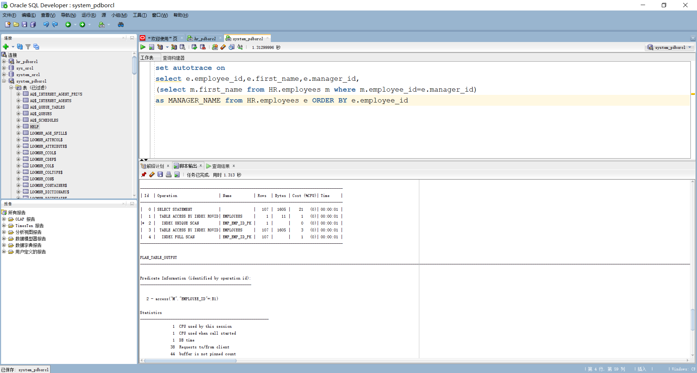
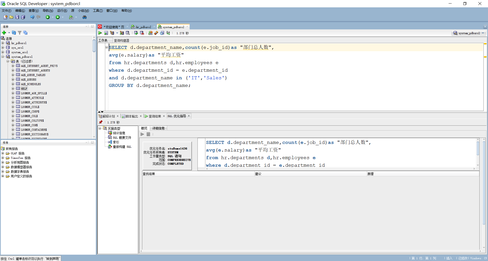

# 实验1：SQL语句的执行计划分析与优化指导

## 实验目的

分析SQL执行计划，执行SQL语句的优化指导。理解分析SQL语句的执行计划的重要作用。

## 实验内容

- 对Oracle12c中的HR人力资源管理系统中的表进行查询与分析。
- 首先运行和分析教材中的样例：本训练任务目的是查询两个部门('IT'和'Sales')的部门总人数和平均工资，以下两个查询的结果是一样的。但效率不相同。
- 设计自己的查询语句，并作相应的分析，查询语句不能太简单。

## 教材中的查询语句

查询1：

```
set autotrace on

SELECT d.department_name,count(e.job_id)as "部门总人数",
avg(e.salary)as "平均工资"
from hr.departments d,hr.employees e
where d.department_id = e.department_id
and d.department_name in ('IT','Sales')
GROUP BY d.department_name;
```




- 查询2

```
set autotrace on

SELECT d.department_name,count(e.job_id)as "部门总人数",
avg(e.salary)as "平均工资"
FROM hr.departments d,hr.employees e
WHERE d.department_id = e.department_id
GROUP BY d.department_name
HAVING d.department_name in ('IT','Sales');
```



- 自己的查询语句

```
set autotrace on

select e.employee_id,e.first_name,e.manager_id,
(select m.first_name from HR.employees m where m.employee_id=e.manager_id)
as MANAGER_NAME from HR.employees e ORDER BY e.employee_id
```




执行上面两个比较复杂的返回相同查询结果数据集的SQL语句，通过分析SQL语句各自的执行计划，判断哪个SQL语句是最优的。最后将你认为最优的SQL语句通过sqldeveloper的优化指导工具进行优化指导，看看该工具有没有给出优化建议

总的来说，查询1比查询2更有，查询2在最后使用到having语句，实际上是先收集数据后分析筛选，参与计算的数据最多。

## 实验参考地址

- Oracle地址：202.115.82.8 用户名：system ， 密码123， 数据库名称：pdborcl，端口号：1521
- 用户hr默认没有统计权限，运行上述命令时要报错：

```
无法收集统计信息, 请确保用户具有正确的访问权限。
统计信息功能要求向用户授予 v_$sesstat, v_$statname 和 v_$session 的选择权限。
```

怎样解决？
hr用户不允许查询执行计划，必须要有plustrace角色才可以。Oracle的插接式数据库本身并没有默认plustrace角色，所以需要在pdborcl数据库中创建角色plustrace。具体过程：用sys登录到PDB数据库，再运行$ORACLE_HOME/sqlplus/admin/plustrce.sql脚本文件，最后通过“GRANT plustrace to 用户名；”命令将plustrace赋予用户	