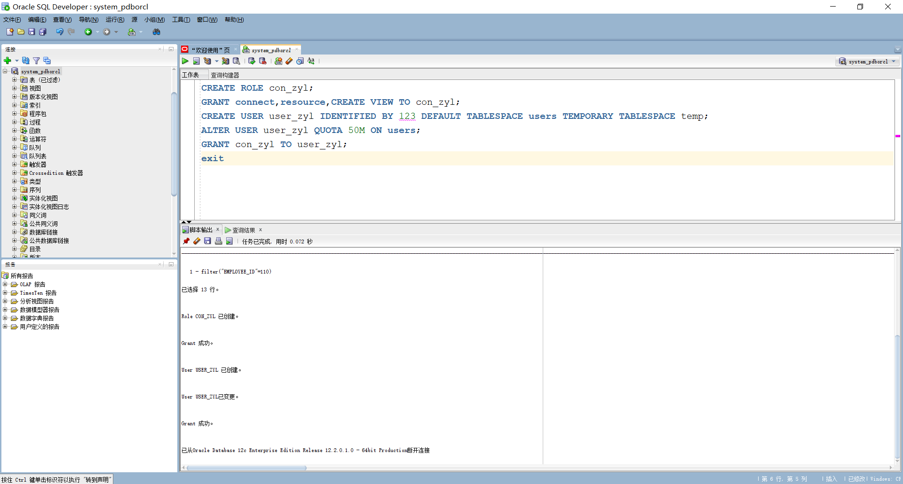
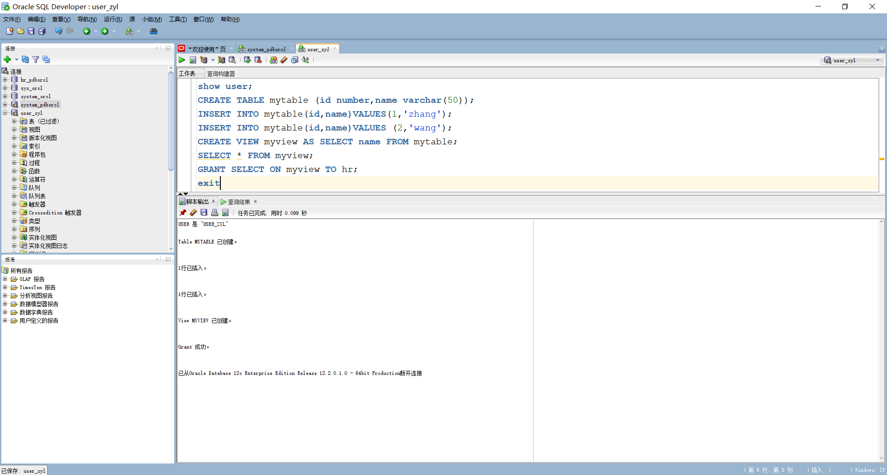
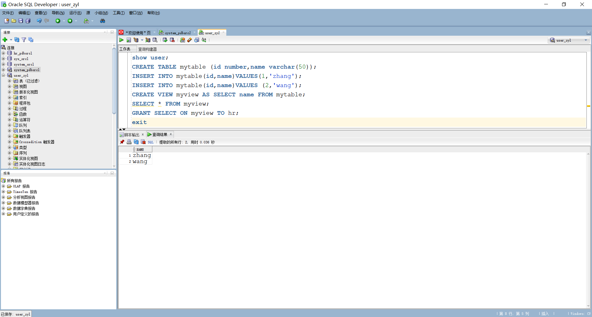
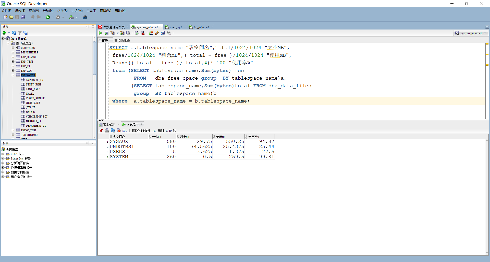

# 姓名：张禹龙

# 学号：201810414128

# 班级：软件工程2018级一班

# 实验2：用户及权限管理

## 实验目的

掌握用户管理、角色管理、权根维护与分配的能力，掌握用户之间共享对象的操作技能。

## 实验内容

Oracle有一个开发者角色resource，可以创建表、过程、触发器等对象，但是不能创建视图。本训练要求：

- 在pdborcl插接式数据中创建一个新的本地角色con_zyl，该角色包含connect和resource角色，同时也包含CREATE VIEW权限，这样任何拥有con_zyl的用户就同时拥有这三种权限。
- 创建角色之后，再创建用户user_zyl，给用户分配表空间，设置限额为50M，授予con_zyl角色。
- 最后测试：用新用户user_zyl连接数据库、创建表，插入数据，创建视图，查询表和视图的数据。

## 实验参考步骤

对于以下的对象名称con_zyl，user_zyl，在实验的时候应该修改为自己的名称。

- 第1步：以system登录到pdborcl，创建角色con_zyl和用户user_zyl，并授权和分配空间：

```
$ sqlplus system/123@pdborcl
SQL> CREATE ROLE con_zyl;
Role created.
SQL> GRANT connect,resource,CREATE VIEW TO con_zyl;
Grant succeeded.
SQL> CREATE USER user_zyl IDENTIFIED BY 123 DEFAULT TABLESPACE users TEMPORARY TABLESPACE temp;
User created.
SQL> ALTER USER user_zyl QUOTA 50M ON users;
User altered.
SQL> GRANT con_zyl TO user_zyl;
Grant succeeded.
SQL> exit
```

> 语句“ALTER USER user_zyl QUOTA 50M ON users;”是指授权user_zyl用户访问users表空间，空间限额是50M。


- 第2步：新用户user_zyl连接到pdborcl，创建表mytable和视图myview，插入数据，最后将myview的SELECT对象权限授予hr用户。

```
$ sqlplus user_zyl/123@pdborcl
SQL> show user;
USER is "user_zyl"
SQL> CREATE TABLE mytable (id number,name varchar(50));
Table created.
SQL> INSERT INTO mytable(id,name)VALUES(1,'zhang');
1 row created.
SQL> INSERT INTO mytable(id,name)VALUES (2,'wang');
1 row created.
SQL> CREATE VIEW myview AS SELECT name FROM mytable;
View created.
SQL> SELECT * FROM myview;
NAME
--------------------------------------------------
zhang
wang
SQL> GRANT SELECT ON myview TO hr;
Grant succeeded.
SQL>exit
```



- 第3步：用户hr连接到pdborcl，查询user_zyl授予它的视图myview

```
$ sqlplus hr/123@pdborcl
SQL> SELECT * FROM user_zyl.myview;
NAME
--------------------------------------------------
zhang
wang
SQL> exit
```

> 测试一下同学用户之间的表的共享，只读共享和读写共享都测试一下。

## 数据库和表空间占用分析

> 当全班同学的实验都做完之后，数据库pdborcl中包含了每个同学的角色和用户。 所有同学的用户都使用表空间users存储表的数据。 表空间中存储了很多相同名称的表mytable和视图myview，但分别属性于不同的用户，不会引起混淆。 随着用户往表中插入数据，表空间的磁盘使用量会增加。

## 查看数据库的使用情况

以下样例查看表空间的数据库文件，以及每个文件的磁盘占用情况。

```
$ sqlplus system/123@pdborcl

SQL>SELECT tablespace_name,FILE_NAME,BYTES/1024/1024 MB,MAXBYTES/1024/1024 MAX_MB,autoextensible FROM dba_data_files  WHERE  tablespace_name='USERS';

SQL>SELECT a.tablespace_name "表空间名",Total/1024/1024 "大小MB",
 free/1024/1024 "剩余MB",( total - free )/1024/1024 "使用MB",
 Round(( total - free )/ total,4)* 100 "使用率%"
 from (SELECT tablespace_name,Sum(bytes)free
        FROM   dba_free_space group  BY tablespace_name)a,
       (SELECT tablespace_name,Sum(bytes)total FROM dba_data_files
        group  BY tablespace_name)b
 where  a.tablespace_name = b.tablespace_name;
```

- autoextensible是显示表空间中的数据文件是否自动增加。
- MAX_MB是指数据文件的最大容量。

