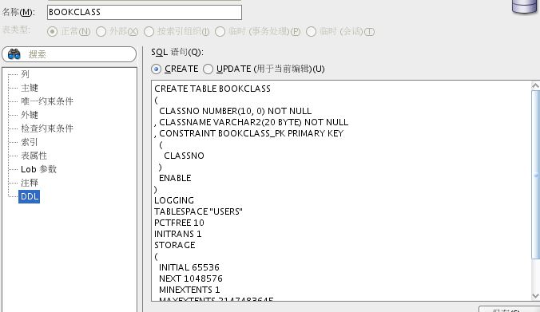
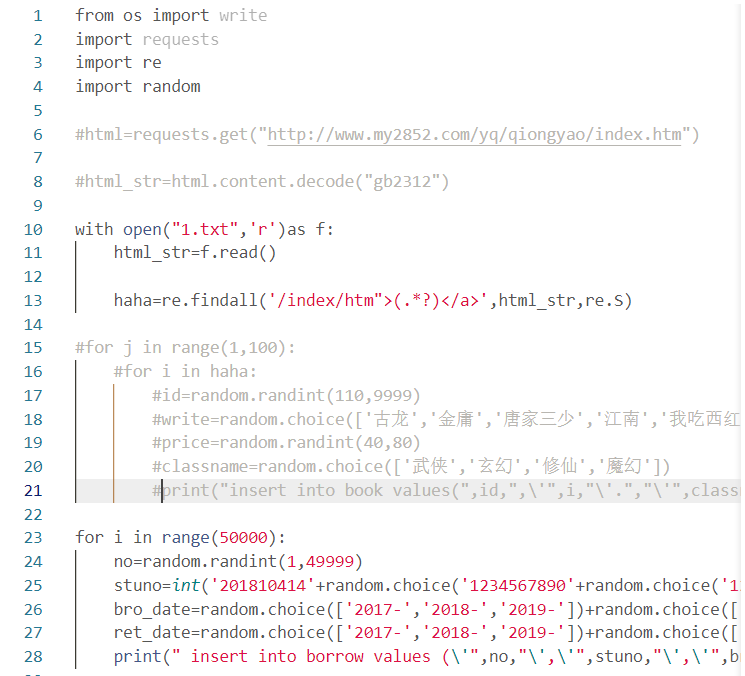

# 姓名：张禹龙

# 学号：201810414128

# 班级：软件工程2018级一班

# 期末项目设计报告

| 题 目    | 基于Oracle的图书管理系统数据库设计 |      |              |
| -------- | ---------------------------------- | ---- | ------------ |
| 课程     | Oracle数据库应用                   |      |              |
| 学 院    | 信息科学与工程学院                 |      |              |
| 专 业    | 软件工程                           | 年级 | 2018级       |
| 学生姓名 | 张禹龙                             | 学号 | 201810414128 |
| 指导教师 | 赵卫东                             | 职称 | 副教授       |

| **评分项**   | **评分标准**                 | **满分** | **得分** |
| ------------ | ---------------------------- | -------- | -------- |
| 文档整体     | 文档内容详实、规范，美观大方 | 10       |          |
| 表设计       | 表，表空间设计合理，数据合理 | 20       |          |
| 用户管理     | 权限及用户分配方案设计正确   | 20       |          |
| PL/SQL设计   | 存储过程和函数设计正确       | 30       |          |
| 备份方案     | 备份方案设计正确             | 20       |          |
| **得分合计** |                              |          |          |

2021 年 6 月 13 日

## 一． 需求分析

1.1背景 
在图书馆的正常运行中，面临着大量的图书、读者信息和借阅、还书信息之间的互动产生。现有的手工记录方法效率低，误差过大，严重影响了图书馆的正常管理。因此，有必要对图书资源、读者资源、借阅信息和归还信息进行管理，及时了解各环节信息的变化，有利于提高管理效率。

1.2数据库选择

ORACLE数据库系统是美国ORACLE公司（甲骨文）提供的以分布式数据库为核心的一组软件产品，是目前最流行的客户/服务器(CLIENT/SERVER)或B/S体系结构的数据库之一。比如SilverStream就是基于数据库的一种中间件。ORACLE数据库是目前世界上使用最为广泛的数据管理系统，作为一个通用的数据库系统，它具有完整的数据管理功能；作为一个关系数据库，它是一个完备关系的产品；作为分布式数据库它实现了分布式处理功能。但它的所有知识，只要在一种机型上学习了ORACLE知识，便能在各种类型的机器上使用它。

1.3 Oracle 的优势

Oracle数据库的优点一：ORACLE7.X以来引入了共享SQL和多线索服务器体系结构。这减少了ORACLE的资源占用，并增强了ORACLE的能力，使之在低档软硬件平台上用较少的资源就可以支持更多的用户，而在高档平台上可以支持成百上千个用户。 Oracle数据库的优点二：提供了基于角色(ROLE)分工的安全保密管理。在数据库管理功能、完整性检查、安全性、一致性方面都有良好的表现。 Oracle数据库的优点三：支持大量多媒体数据，如二进制图形、声音、动画以及多维数据结构等。 Oracle数据库的优点四：提供了与第三代高级语言的接口软件PRO*系列，能在C,C++等主语言中嵌入SQL语句及过程化(PL/SQL)语句，对数据库中的数据进行操纵。加上它有许多优秀的前台开发工具如 POWER BUILD、SQL*FORMS、VISIA BASIC 等，可以快速开发生成基于客户端PC 平台的应用程序，并具有良好的移植性。 Oracle数据库的优点五：提供了新的分布式数据库能力。可通过网络较方便地读写远端数据库里的数据，并有对称复制的技术。

## **二． 概念结构设计**

2.1表空间设计 
创建一个表空间USERS02，用于保存书籍管理系统的各种表，首先需要定义数据文件的存储地址，并且定义该数据文件的大小为200M、的分配方式为自动扩展、表空间的管理方式为本地管理。

2.2数据表设计 
创建五个表，存储在表空间users中。这五个表是学生表、图书表、借阅表和管理员表，书籍种类表。

学生表的作用是存放学生信息，学号，学生姓名，等等学生相关的信息。

图书表的作用是存放图书信息，编号，书名，作者，价格等图书的相关信息。

借阅表的作用是对学生表和图书表的一个链接，显示哪些人借的哪些书。借阅的日期和还书日期等信息。

书籍种类表的作用是将图书表的书进行分类，存放种类编号，种类名等信息。

管理员信息表的作用是用于存放管理员的账号，密码，姓名，加入日期等相关信息。

2.3存储过程和函数设计

存储过程的作用相当于单个表的操作方法，暂且只针对单个表的操作，例如调用存储过程的时候传一个Dept的参数，然后输出满足这个条件的学号和姓名，实现上面功能只调用这个存储过程就行。 函数的创建与存储过程的创建相似，不同之处在于，函数有一个显示的返回值。所以函数里面必须包含一个return语句，来指明函数的返回值，能限定函数返回值的类型，但是无法约束返回值的长度，精度，刻度等。最终也只有一个return背执行。

2.4备份与恢复设计 

在对Oracle数据库进行备份与恢复设计时，要考虑发生故障后，利用已备份的数据或控制文件，重新建立一个完整的数据库。恢复可以是实例恢复或者是介质恢复，实例恢复是在当oracle实例出现失败后，oracle自动进行的恢复。而介质恢复则是在当存放数据库的介质出现故障时进行恢复。 2.5数据库安全设计 数据库安全设计主要体现在为数据库建立用户，密码，以及不同等级用户的的权限！这样做就可以有效的让不同用户查阅的权限都在管理员的管理下，防止数据的改动和丢失！因此要访问数据库，用户必须指定有效的数据库用户账户，而且还要根据该用户账户的要求成功通过验证，每个数据库用户都有一个唯一的数据库账户。 在本次综合实验中，我主要创建了system_gpfish和system_admin两个角色，分别对应不同的权限，这样就加强了对数据库的保护。另外，创建概要文件来描述如何使用系统的资源(主要是CPU资源)。将概要文件赋予某个数据库用户，在用户连接并访问数据库服务器时，系统就按照概要文件给他分配资源。

## **三． 逻辑结构设计**

数据表的设计

书籍表设计BOOK 

| **字段名**   | **数据类型**                 | **可以为空** | **注释** |
| ------------ | ---------------------------- | ------------ | -------- |
| bookno       | Number(10,0) | no           |     书籍编号，主键      |
| bookname     | Varchar2(20,BYTE)  | no          |    书名      |
| bookclass    | Varchar2(20,BYTE)    | no         |     书的种类，书种类表外键      |
| writer       | Varchar2(20,BYTE)        | no          |     价格     |


书的种类表设计BOOKCLASS 

| **字段名**   | **数据类型**                 | **可以为空** | **注释** |
| ------------ | ---------------------------- | ------------ | -------- |
| classno       | Number(10,0) | no           |     书籍种类的编号，主键    |
| classname     | Varchar2(20,BYTE)  | no          |    书籍的种类名      |


管理员表设计MANAGER 

| **字段名** | **数据类型**      | **可以为空** | **注释**             |
| ---------- | ----------------- | ------------ | -------------------- |
| Adminname    | Varchar2(20,BYTE)      | no           | 管理员账号，主键 |
| pwd   | Varchar2(20,BYTE) | no           | 管理员密码    |
|  mname    | Varchar2(20,BYTE) | no | 管理员姓名 |
| Join_date | DATE | no | 加入日期 |


借阅信息表设计BORROW 

| **字段名**  | **数据类型**       | **可以为空** | **注释**             |
| ----------- | ------------------ | ------------ | -------------------- |
| bookno      | Varchar2(200,BYTE) | no           | 书籍编号，书籍表外键 |
| studyno     | Varchar2(200,BYTE) | no           | 学生学号，学生表外键 |
| Borrow_date | Varchar2(20,BYTE)  | no           | 借书日期             |
| Return_date | Varchar2(20,BYTE)  | no           | 还书日期             |


学生信息表设计STUDENT 

| **字段名** | **数据类型**      | **可以为空** | **注释**       |
| ---------- | ----------------- | ------------ | -------------- |
| username   | Varchar2(20,BYTE) | no           | 学生账号       |
| studyno    | Number(10,0)      | no           | 学生学号，主键 |
| name       | Varchar2(10,BYTE) | no           | 学生姓名       |
| password   | Varchar2(20,BYTE) | no           | 学生密码       |
| phone      | Number(20,0)      | no           | 学生电话       |

## **四． 物理结构设计**

创建user02表空间并分配数据文件，表空间初始大小200M，然后创建了一个名叫bookbases的数据库，指定了它的存储位置，以及创建数据库名为gpfish的管理员，创建角色system_gpfish和用户system_admin，然后授权和分配空间

```
CREATE TABLESPACE User02
DATAFILE
‘/home/oracle/app/oradata/orcl/pdborcl/pdbtest_user02_1.dbf’
SIZE 100M AUTOEXTEND ON NEXT 256M MAXSIZE UNLIMITED,
‘/home/oracle/app/oradata/orcl/pdborcl/pdbtest_user02_2.dbf’
SIZE 100M AUTOEXTEND ON NEXT 256M MAXSIZE UNLIMITED
EXTENT MANAGEMENT LOCAL SEGMENT SPACE MANAGEMENT AUTO;


create p1uggable database bookbases admin user gpfish identified by 123456 file_name_convert=('/home/orac1e/gpfish/myscott/',' /home/orac1e/gpfish/myscott2');|
$ sqlplus system/123@pdborcl
SQL> CREATE ROLE system_gpfish;
Role created.
SQL> GRANT connect,resource,CREATE VIEW TO system_gpfish;Grant succeeded.
SQL> CREATE USER system_admin IDENTIFIED BY 123456 DEFAULT TABLESPACE users TEMPORARY TABLESPACE temp;
User created.
SQL> ALTER USER new_user QUOTA 50M ON users;
User altered.
SQL> GRANT system_gpfish TO system_admin;Grant succeeded.
SQL> exit
```

然后对新创建的角色进行select,delete,insert,updata等权限. 此时使用创建好的用户system_gpfish登录,创建实体表.

书籍表的创建

```
CREATE TABLE BOOK 
(
  BOOKNO NUMBER(10, 0) NOT NULL 
, BOOKNAME VARCHAR2(20 BYTE) NOT NULL 
, BOOKCLASS VARCHAR2(20 BYTE) NOT NULL 
, WRITER VARCHAR2(20 BYTE) NOT NULL 
, PRICE NUMBER(10, 0) NOT NULL 
, CONSTRAINT BOOK_PK PRIMARY KEY 
  (
    BOOKNO 
  )
  ENABLE 
) 
LOGGING 
TABLESPACE "USERS" 
PCTFREE 10 
INITRANS 1 
STORAGE 
( 
  INITIAL 65536 
  NEXT 1048576 
  MINEXTENTS 1 
  MAXEXTENTS 2147483645 
  BUFFER_POOL DEFAULT 
);
```


种类表的创建

```
CREATE TABLE BOOKCLASS 
(
  CLASSNO NUMBER(10, 0) NOT NULL 
, CLASSNAME VARCHAR2(20 BYTE) NOT NULL 
, CONSTRAINT BOOKCLASS_PK PRIMARY KEY 
  (
    CLASSNO 
  )
  ENABLE 
) 
LOGGING 
TABLESPACE "USERS" 
PCTFREE 10 
INITRANS 1 
STORAGE 
( 
  INITIAL 65536 
  NEXT 1048576 
  MINEXTENTS 1 
  MAXEXTENTS 2147483645 
  BUFFER_POOL DEFAULT 
);	
```



管理员表创建

```
CREATE TABLE MANAGER 
(
  ADMINNAME VARCHAR2(20 BYTE) NOT NULL 
, PWD VARCHAR2(20 BYTE) NOT NULL 
, MNAME VARCHAR2(20 BYTE) NOT NULL 
, JOIN_DATE DATE NOT NULL 
, CONSTRAINT MANAGER_PK PRIMARY KEY 
  (
    ADMINNAME 
  )
  ENABLE 
) 
LOGGING 
TABLESPACE "USERS" 
PCTFREE 10 
INITRANS 1 
STORAGE 
( 
  BUFFER_POOL DEFAULT 
);	
```


学生表的创建

```
CREATE TABLE STUDENT 
(
  USERNAME VARCHAR2(20 BYTE) NOT NULL 
, STUDYNO NUMBER(10, 0) NOT NULL 
, NAME VARCHAR2(10 BYTE) NOT NULL 
, PASSWORD VARCHAR2(20 BYTE) NOT NULL 
, PHONE NUMBER(20, 0) NOT NULL 
, CONSTRAINT STUDENT_PK PRIMARY KEY 
  (
    STUDYNO 
  )
  ENABLE 
) 
LOGGING 
TABLESPACE "USERS" 
PCTFREE 10 
INITRANS 1 
STORAGE 
( 
  BUFFER_POOL DEFAULT 
);
```


借阅信息表的创建

```
CREATE TABLE BORROW 
(
  BOOKNO VARCHAR2(200 BYTE) NOT NULL 
, STUDYNO VARCHAR2(200 BYTE) NOT NULL 
, BORROW_DATE VARCHAR2(20 BYTE) NOT NULL 
, RETURN_DATE VARCHAR2(20 BYTE) NOT NULL 
) 
LOGGING 
TABLESPACE "USERS" 
PCTFREE 10 
INITRANS 1 
STORAGE 
( 
  INITIAL 65536 
  NEXT 1048576 
  MINEXTENTS 1 
  MAXEXTENTS 2147483645 
  BUFFER_POOL DEFAULT 
);	
 
```


## 五． 数据库实施代码**

5.1插入数据

数据来源于网络，通过爬虫获取，然后自动生成了sql语句转移到sqldeveloper进行插入 Python程序如下：

 




根据每张表的不同字段修改python程序，生成对应的sql语句对剩下的四张表进行信息生成然后进行插入。 [


5.2程序包建立

（1） 建立一个程序包里面有一个函数和一个存储过程,用来获取书的种类和删除管理员，先建包 []

```
create or replace PACKAGE MyPack 
  IS
 
  FUNCTION get_bookclass(classno NUMBER) RETURN varchar2;
  PROCEDURE delmanager (adminuser in manager.adminname%type);
END MyPack;


create or replace package body MyPack 
is
  function get_bookclass(classno number)
  RETURN varchar2
  IS class_name 
  varchar2;
    BEGIN
      SELECT * into class_name  
        FROM bookclass WHERE classno = bookclass.classno;
      RETURN class_name;
    END get_bookclass;
    
    
 PROCEDURE delmanager
 (adminuser in manager.adminname%type)
  AS
    no_result EXCEPTION;
    begin
      
    delete from manager where adminname = adminuser;
    if sql%notfound then
      raise no_result;
    end if;
    dbms_output.put_line('delete completed!!!');
  exception
    when no_result then
      dbms_output.put_line('not found!!!');
    when others then
      dbms_output.put_line(sqlcode||'------'||sqlerrm);
    
    END;
END MyPack;
/
```

5.3建立备份方案 备份脚本如下：

```
#rman_level1.sh 
#!/bin/sh

export NLS_LANG='SIMPLIFIED CHINESE_CHINA.AL32UTF8'
export ORACLE_HOME=/home/oracle/app/oracle/product/12.1.0/dbhome_1  
export ORACLE_SID=orcl  
export PATH=$ORACLE_HOME/bin:$PATH  


rman target / nocatalog msglog=/home/oracle/rman_backup/lv1_`date +%Y%m%d-%H%M%S`_L0.log << EOF
run{
configure retention policy to redundancy 1;
configure controlfile autobackup on;
configure controlfile autobackup format for device type disk to '/home/oracle/rman_backup/%F';
configure default device type to disk;
crosscheck backup;
crosscheck archivelog all;
allocate channel c1 device type disk;
backup as compressed backupset incremental level 1 database format '/home/oracle/rman_backup/dblv1_%d_%T_%U.bak'
   plus archivelog format '/home/oracle/rman_backup/arclv1_%d_%T_%U.bak';
report obsolete;
delete noprompt obsolete;
delete noprompt expired backup;
delete noprompt expired archivelog all;
release channel c1;
}
EOF

exit
```

测试：

```
[oracle@oracle-pc ~]$ cat rman_level.sh
[oracle@oracle-pc ~]$ ./rman_level.sh
```

开始备份： []

为了测试备份功能是否能够使用，现在模拟进行数据损坏备份，首先删除数据库文件：

```
[oracle@oracle-pc~]$rm /home/oracle/app/oracle/oradata/orcl/pdborcl/SAMPLE_SCHEMA_users01.dbf
```

然后通过备份脚本进行数据恢复：

```
sqlplus / as sysdba
SQL>shutdown immediate
SQL>shutdown abort
SQL>startup mount
rman target /
```

5.4容灾方案

a、primary库端的配置 a1.创建pfile文件

```
SQL> create pfile=’/tmp/1.sql’ from spfile;
File created.
```

a2.备份全库

```
RMAN> run
2> {allocate channel c1 type disk;
3> allocate channel c2 type disk;
4> backup database format ‘/backup/full_%d_%T_%s_%p’;
5> }
```

a3.生成standby控制文件

```
SQL> alter database create standby controlfile as ‘/tmp/1.ctl’;
```

Database altered.

a4.将参数文件，密码文件，控制文件备份，全库备份传输到standby库端。

a5.配置tnsnames.ora文件，将primary、standby库的内容编辑进去。

a6.修改相关参数文件参数

```
SQL> alter system set log_archive_dest_2=’service=standby’ scope=spfile;

System altered.

SQL> alter system set fal_server=standby scope=spfile;

System altered.

SQL> alter system set fal_client=primary scope=spfile;

System altered.
```

b、standby库端的配置

b1.修改参数文件，将如下内容加入： *.standby_archive_dest=’location=/arch’（11g之后废弃了这个参数） *.log_archive_dest_1=’location=/arch’ *.fal_server=primary *.fal_client=standby *.db_file_name_convert=’/u01/app/oracle/oradata/orcl’,'/u01/oradata’ （’primary端数据文件位置’，‘standby端数据文件位置’） *.log_file_name_convert=’/u01/app/oracle/oradata/orcl’,'/u01/oradata’ *.standby_file_management=auto b2.使用修改过的pfile文件启动 SQL> startup pfile=’/tmp/1.sql’ nomount;

b3.rman恢复控制文件

```
RMAN> run
2> {restore controlfile from ‘/tmp/1.ctl’;
3> }
```

b4.mount状态恢复数据文件

```
SQL> alter database mount standby database;

Database altered.
RMAN> run
2> {restore database;
3> }

SQL> select name from v$datafile;
```

NAME ——————————————————————————– / oracle /oradata/system01.dbf / oracle /oradata/sysaux01.dbf / oracle /oradata/undotbs01.dbf / oracle /oradata/users01.dbf

b5.在standby库端启用自动恢复 SQL> alter database recover managed standby database disconnect from session;

Database altered.

b6.查看alert日志，归档是否正常传输 

tail -f alert* ….. Media Recovery Log /oracle/orcl_1_42_847205316.arch Media Recovery Log / oracle /orcl_1_43_847205316.arch Media Recovery Log / oracle /orcl_1_44_847205316.arch Media Recovery Waiting for thread 1 sequence 45 (in transit)

[oracle@oracle]$ ls -l /oracle total 12240 -rw-r—– 1 oracle oinstall 5683200 May 12 06:39 orcl_1_15_847205316.arch -rw-r—– 1 oracle oinstall 23552 May 12 06:39 orcl_1_16_847205316.arch -rw-r—– 1 oracle oinstall 145920 May 12 06:39 orcl_1_17_847205316.arch -rw-r—– 1 oracle oinstall 48128 May 12 06:39 orcl_1_18_847205316.arch

## **六．体会与总结**

通过自己实现的这个基于Oracle的书籍管理系统，体会到Oracle与Mysql数据库的差别，相比于MySQL，Oracle要相对难一点，但是功能性也更强一点